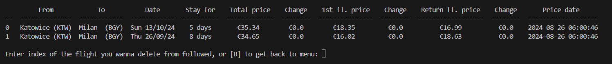
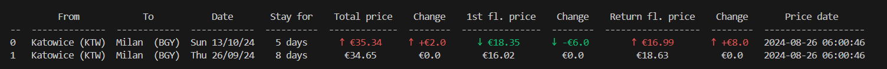
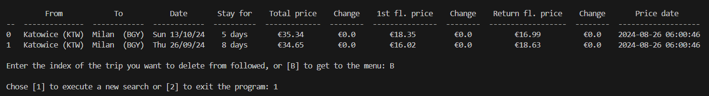
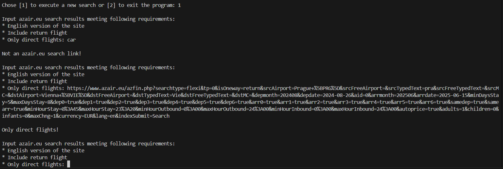
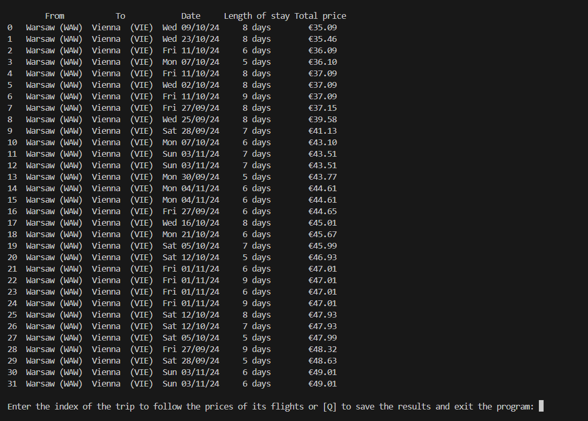
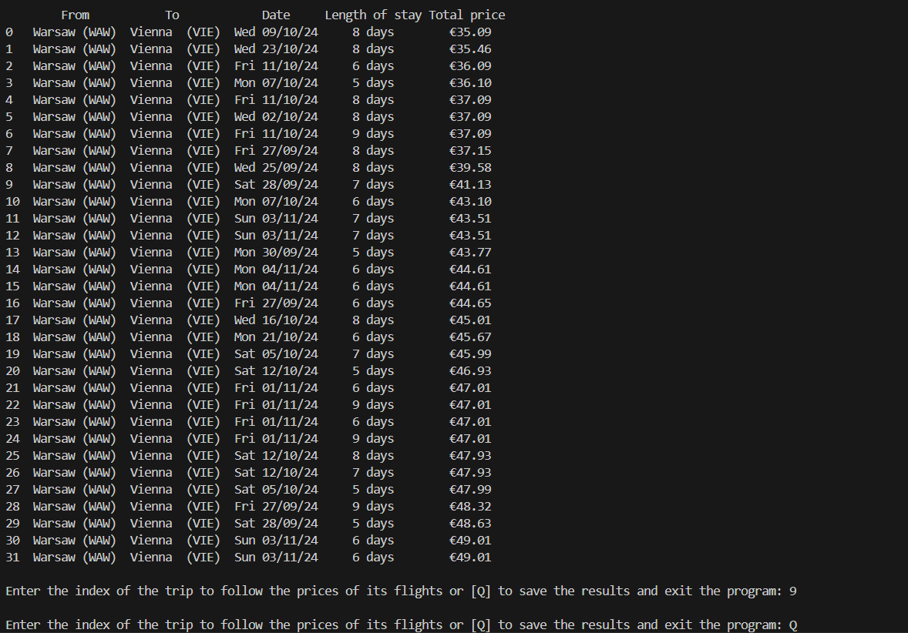
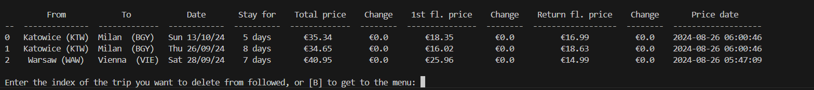

# Flights Prices Updater

azair.eu is a website allowing to search for a cheap flights with various different options. This program is designed to scrap trips from azair.eu web search results, save those in which the user is interested in, and then check for updated prices for flights in those trips.

Basic behaviour
Print basic data of the saved trips, as well as updated prices of flights that are included in those trips, if any trip is saved
Ask the user to input the index of the trip he is no longer interested in to delete the trip, or go back to the menu. The user is asked repeatedly for the input as long as he goes back to the menu, or there are no more trips to delete. The user is asked to reinput if the input wasn't an integer, or if the integer was out of range of the indexes.
Ask the user if he wants to begin with new scraping to save another trip, or quit the program.
If the user begins with the new scraping, he is asked for the url to azair.eu search results that includes trips he wants to save. The search should be done with the following options:
English version of the site
Return flights included, no one-way trips
Only direct flights
If any of the above conditions is not satisfied, the user is asked to reinput.
If the url is ok, the program prints the table with every trip included in the search and asks the user to input the index of the trip he wants to save and follow it's prices, or to input Q to exit the program and save results. The user is asked repeatedly for the input until he enters Q.

## Authors

- [@maciekd777](https://github.com/maciekd777)

## Tech Stack

**Data preparation:** BeautifulSoup

**Data manipulation:** Pandas

## Basic behaviour

* Print basic data of the saved trips, as well as updated prices of flights that are included in those trips, if any trip is saved
* Ask the user to input the index of the trip he is no longer interested in to delete the trip, or go back to the menu. The user is asked repeatedly for the input as long as he goes back to the menu, or there are no more trips to delete. The user is asked to reinput if the input wasn't an integer, or if the integer was out of range of the indexes.
* Ask the user if he wants to begin with new scraping to save another trip, or quit the program.
* If the user begins with the new scraping, he is asked for the url to azair.eu search results that includes trips he wants to save. The search should be done with the following options:
  * English version of the site
  * Return flights included, no one-way trips
  * Only direct flights
* If any of the above conditions is not satisfied, the user is asked to reinput.
* If the url is ok, the program prints the table with every trip included in the search and asks the user to input the index of the trip he wants to save and follow it's prices, or to input Q to exit the program and save results. The user is asked repeatedly for the input until he enters Q.
## Detailed behaviour 

* Program starts with creating `DataReader` object, which reads the csv file `flights_data.csv` via `csv.DictReader`, then save the dictionaries of data in a list `l`, and then returns this list, which value is assign to the variable `saved_data` in the main function. If `saved_data` is successfully crested, the program continues on with creating two empty lists: `check_table` and `updated_prices`. Then, using the `requests` module and the data inside the `saved_data` list, the program is checking for the latest prices of flights included in the trip, which are automatically converted to euros thanks to the `currency_converter` module, and for the date of the latest price changes. Saved values are compared to scraped latest values and results are added to `check_table` for the user friendly table input (using colorama module), and then the latest values are appended to the `updated_prices` list, which is used to overwrite and update `flights_data.csv`. Then, the table is printed, using the `tabulate` module and data from the `check_table` list and the user is asked to either delete the trip entering its index, or go back to the menu by inputting B. The user is asked repeatedly for input (work of the while loop) as long as he enters B or there are no more trips to delete (program gets out of the loop). If the file doesn`t exist at the beginning, an empty list saved_data is created and the program gets out of the loop immediately.

* Program starts with creating `DataReader` object, and upon its initialization creates a list `saved_data_list` . Next, program calls `DataReader` method - `create_saved_data_list` - which reads the csv file `flights_data.csv` via `csv.DictReader`, if the file exists, and appending to `saved_data_list` dictionaries containing saved data (one dictionary for one trip saved in the `fliights_data_list` file). If the file doesn't exist, `FileNotFoundError` is raised and then, the file is created with written headers. Note that the file `flights_data.csv` doesn't need to exist for the program to be working, but the `saved_data` directory is needed. For the readability, in the `main` function, `saved_data_list` is assigned to the `remaining_data` variable. 

* If `remaining data` contains some elements (in other words, if `flights_data.csv` contains some data), `PricesUpdater` object is created with `data_to_print` and `updated_data_to_save` attributes, and the method `prices_scraper` is called with `remaining_data` as a parameter. Then, using the data inside `remaining_data` list, the program updates prices of the flights of saved trips and appends it to two lists:
   - data appended to list `data_to_print` is a data that's needed for printing the table, such as destination of the trip, its date, length of stay (in days), and prices of both flights, as well as the total price. Prices and its changes inside this list are also colored using `colorama` module if the actual prices scraped from the webside are bigger/smaller than those saved in the file.
  - data appended to list `updated_data_to_save` is a data that will be used to overwrite `flights_data.csv` with the actual prices. Data inside this list is almost identical to `data_to_print`, but prices are not colored, there are no changes to prices, because it doesn't makes sense to save it, and there is additional information about IDs of the flights of the trips. It is needed to scrape information about actual prices of the flights, but it isn't really needed to be printed, so it is not included in the `data_to_print` list.
Then, the `updated_prices_to_csv` method is called, and data from `updated_data_to_save` is used to overwrite `flights_data.csv` file with `csv.DictWriter`. It is ok to overwrite all the file, because `updated_data_to_save` contains all of the information about each trip that was saved in the file, but with updated prices, so nothing is changed but the prices. Just before the while loop, the method `updated_prices_displayer` is called, and the table with updated prices is printed using `tabulate` module and `data_to_print` list.

<figure>

Two saved trips from Katowice to Milan and the latest prices of the flights. In this example there is no difference between the prices scraped just after the program was run and the ones saved by the program after updating the prices last time

</figure>

<figure>

The same trips, but with manually changed saved prices, just to show how the program reacts to the prices changes. The latest price of the flight from Katowice to Milan ("1st flight") of the trip indexed "0" is 6 euros less compared to its saved price in the file, however the latest price of the flight from Milan to Katowice ("return flight") is 8 euros bigger compared to its saved price. As a result, the latest total price is now 2 euros bigger compared to the price saved by the program the last time

</figure>

* After the printing, the program enters the `while` loop, inside which user will be able to delete the trips he already follows. The loop can run as long as length of `remaining_data` is bigger than 0, in other words, as long as there is any trip left to delete. The loop starts with assigning to the `i` variable the return value of the `ask_for_index` function:
 - The `ask_for_index` function is called whenever the program wants to print a `question` to get from the user a value that is inside some `index_range`. In some places in the program there is also a possiblity of inputing a special character `quit_char`, which allows the user to get out from the loop. This function also consist of the `while` loop, but it's created to ask the user again if the input wasn't inside the `index_range` or it wasn't the `quit_char`. If the input is inside the `index_range`, the function returns the input. 
 In this situation, the `index_range` consists of all of the numbers from 0 to `len(remaining_data)`, and the `quit_char` is `b`, so if the user inputs `b`, it gets out of the loop and no trip is deleted from followed. However, if the user inputs index that is next to the trip on the printed table, the procedure of deleting a trip will be started. Firstly, the function `del_index_from_list` is called with `remaining_data` and `i` as arguments, and it asks the user if he really wants to delete this trip from followed. If the user inputs `n`, nothing changes, the program again prints the table and once again enters the loop. If the input was `y`, the trip at the index `i` is deleted from `saved_data_list` attribute of the `data_reader` object (from the main function we access this value by `remaining_data` variable) using `delete_trip` method, and also the `reset_lists` module of the `prices_updater` object is called to empty the `data_to_print` and `updated_data_to_save` lists. It is necessary to do, because we want to overwrite `flights_data.csv`, but without the deleted trip. To achieve that, we need to have the `updated_data_to_save` list, but without the deleted trip, so the program calls `prices_scraper` with updated `remaining_data`. However, if we wouldn't empty the lists, the `prices_scraper` would append the trips again and duplicate them. Then, `updated_prices_to_csv` method is called, and the updated table is printed. Note, that `updated_prices_displayer` is called only when there is anything left in `remaining_data`, becuase if it is empty, the printed table would only have unedited headers, which doesn't look that pretty.

* After getting out of the while loop, the program is printing the "menu", which isn't actually a menu, it's just a choice between starting new scraping or exiting the program via `sys.exit`. To get the correct input, the `ask_for_index` function is called once again, but this time with a different `question`, `index_range` equals to `[1, 2]`, and no `quit_char`.

<figure>

After getting out of the "deletion" while loop, the program prints out the "menu" where it's asking the user to start new search or exit the program

</figure>

* If the user wants to start a new scraping, the object of the `NewDataParser` class is created with couple of lists and `url` attributes. Right after the program enters the while loop, which runs until the method `get_url` doesn't return azair.eu search results link meeting the following requirements:
  * The website must be in english
  * Return flights included, no one-way trips
  * Only direct flights
The first requirement is needed to match regular expression used to create `len_of_stay_list`, and the other ones are making sure that search results don't have too many or too few flights. Obviously, inside the `get_url` function the user is asked for the correct url and the function returns the url only if it met all the requirements written using the `re.search` function.

<figure>

The program asking the user to reinput two times after two wrong inputs, "car", and an azair.eu search results URL, but with "max changes" option equal to 1, not to 0 (direct flights requirement not met)

</figure>

* After inputting the correct URL, the method `parse_results` is called, which use the `beautifulsoup4` module to scrape specific data from the website and append it to one of the lists: `cities_from`, `cities_to`, `id_list`, `dates`, `len_of_stay_list`, `there_price_list`, `back_price_list`, `total_price_list`.

* Right after that, the method `print_parsed_results` is called, and it uses the `pandas` module to create a `DataFrame` object to print a table from the `data_to_print` dictionary, containing lists that are valuable for printing 

<figure>

Printed table with search results of the correct link

</figure>

* After printing the table, the `ask_for_index` function is called with `question` about index of the trip he wants to save and follow its flights prices, `index_range` equals to `range(len(id_lists))`, which contains all the indexes next to the trips printed in the table, and if the user doesn't want to save anything, he can quit by inputing `q`, which is the `quit_char` in this situation. After inputting any correct index, the program checks if the IDs of the flights of the trip at that index are already saved in the `saved_data_list`. If so, the program prints "Trip already followed!" and doesn't save anything to the file. If there is no such IDs, the program runs `save_trip` method, which scrapes all the needed information and appends it to the `flights_data.csv` file. When the appending is done, the `data_reader.create_saved_data_list` method is called just to have the newly saved trip inside the `saved_data_list`. It is necessary to do it now, because of the previous checking of the already followed IDs. If we wouldn't update the list, we could add several times the sime trip to followed and it would be appended, not overwritten. After the saving, loop is doing its work and goes back to the beginning to ask the user if he wants to add another trip to followed. The program ends with the user inputting `q`.

<figure>

The user has chosen to follow the flight prices of the trip indexed 9 and did exit the program

</figure>

<figure>

When running the program now, the trip recently added to following shows in the table and the prices of its flights are updated (total price in the table can differ a little bit from the total price shown in the search result, because scraped prices sometimes needs to be converted into euros from various other currencies)

</figure>
## Badges

Add badges from somewhere like: [shields.io](https://shields.io/)

